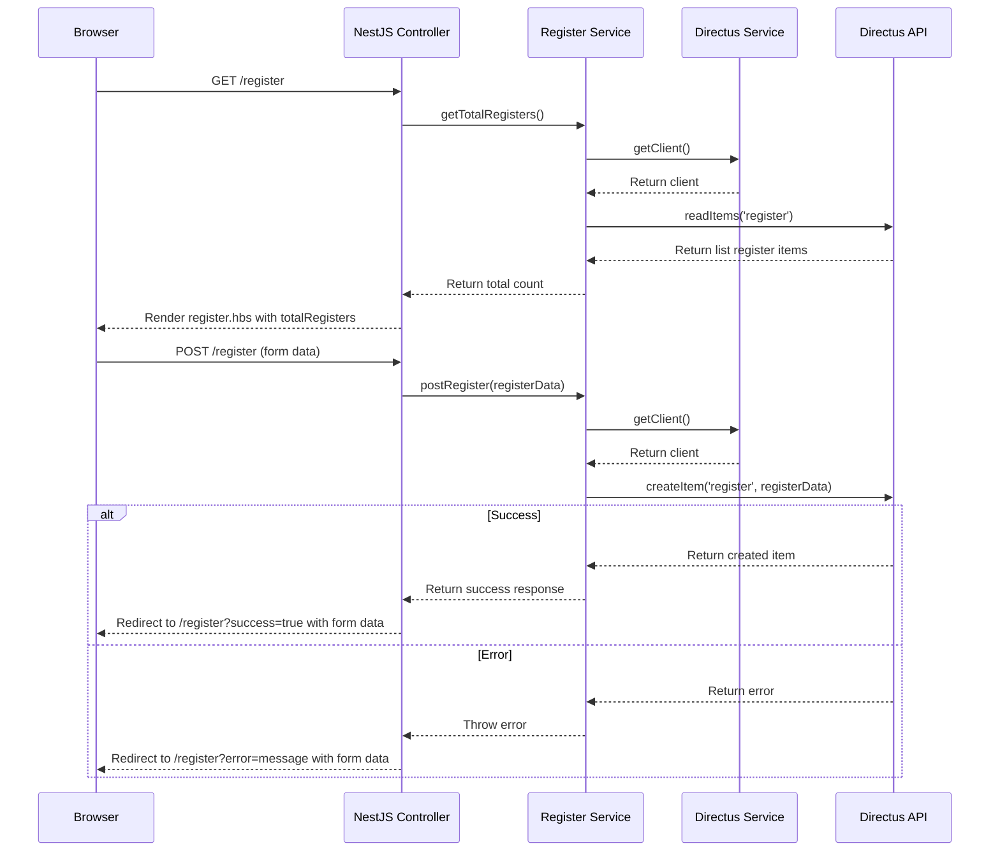
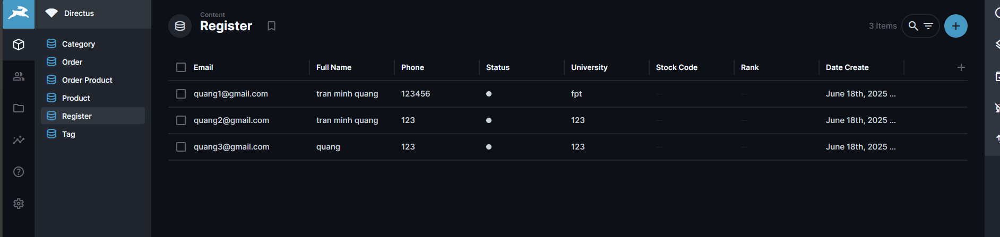
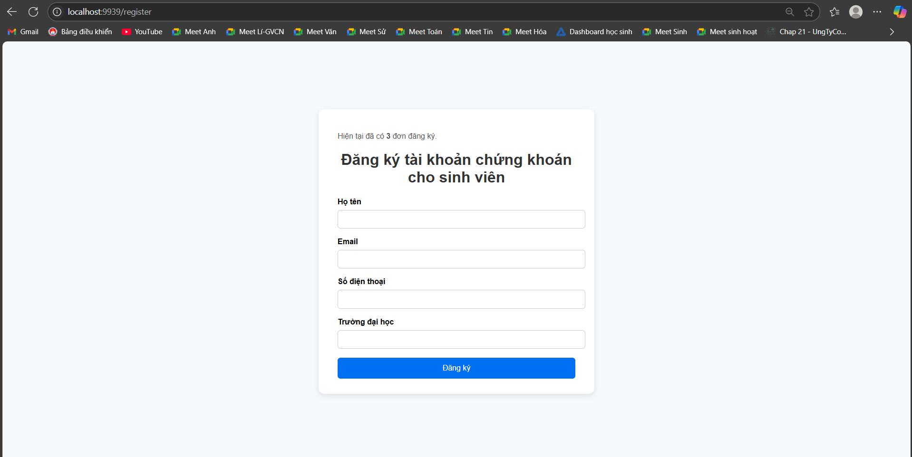

```mermaid
sequenceDiagram
      participant Browser
    participant NestJS as NestJS Controller
    participant Service as Register Service
    participant Directus as Directus Service
    participant DirectusAPI as Directus API

    %% GET Request Flow - Display Form
    Browser->>NestJS: GET /register
    NestJS->>Service: getTotalRegisters()
    Service->>Directus: getClient()
    Directus-->>Service: Return client
    Service->>DirectusAPI: readItems('register')
    DirectusAPI-->>Service: Return list register items
    Service-->>NestJS: Return total count
    NestJS-->>Browser: Render register.hbs with totalRegisters

    %% POST Request Flow - Submit Registration
    Browser->>NestJS: POST /register (form data)
    NestJS->>Service: postRegister(registerData)
    Service->>Directus: getClient()
    Directus-->>Service: Return client
    Service->>DirectusAPI: createItem('register', registerData)
    
    alt Success
        DirectusAPI-->>Service: Return created item
        Service-->>NestJS: Return success response
        NestJS-->>Browser: Redirect to /register?success=true with form data
    else Error
        DirectusAPI-->>Service: Return error
        Service-->>NestJS: Throw error
        NestJS-->>Browser: Redirect to /register?error=message with form data
    end
```

 
 