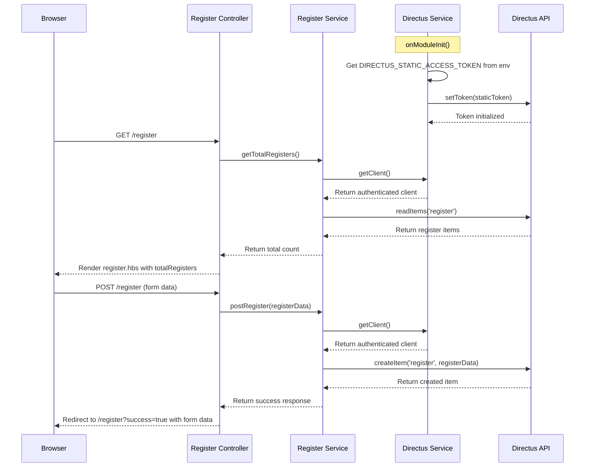
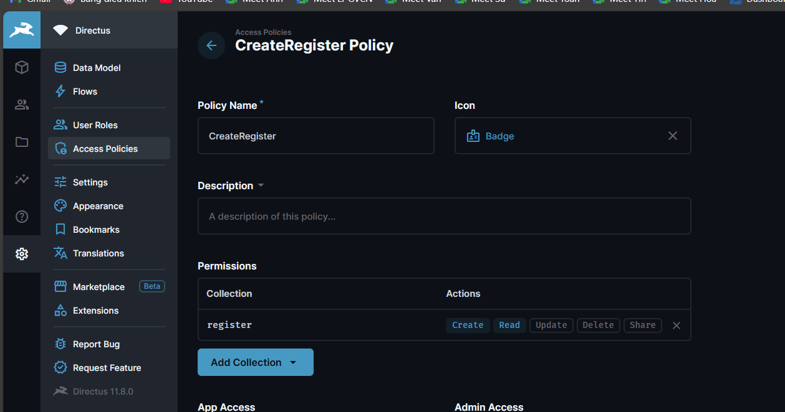
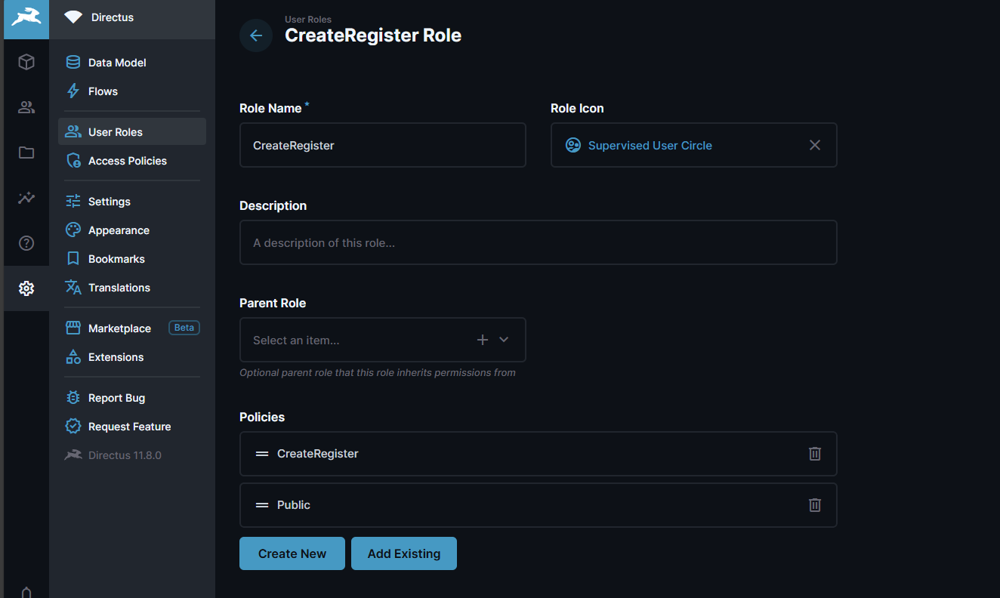

```mermaid
sequenceDiagram
    participant Browser
    participant NestJS as Register Controller
    participant RegSvc as Register Service
    participant DirSvc as Directus Service
    participant DirectusAPI as Directus API

    %% Initialization Phase
    Note over DirSvc: onModuleInit()
    DirSvc->>DirSvc: Get DIRECTUS_STATIC_ACCESS_TOKEN from env
    DirSvc->>DirectusAPI: setToken(staticToken)
    DirectusAPI-->>DirSvc: Token initialized

    %% GET Request Flow - Display Form
    Browser->>NestJS: GET /register
    NestJS->>RegSvc: getTotalRegisters()
    RegSvc->>DirSvc: getClient()
    DirSvc-->>RegSvc: Return authenticated client
    RegSvc->>DirectusAPI: readItems('register')
    DirectusAPI-->>RegSvc: Return register items
    RegSvc-->>NestJS: Return total count
    NestJS-->>Browser: Render register.hbs with totalRegisters

    %% POST Request Flow - Submit Registration
    Browser->>NestJS: POST /register (form data)
    NestJS->>RegSvc: postRegister(registerData)
    RegSvc->>DirSvc: getClient()
    DirSvc-->>RegSvc: Return authenticated client
    RegSvc->>DirectusAPI: createItem('register', registerData)
    DirectusAPI-->>RegSvc: Return created item
    RegSvc-->>NestJS: Return success response
    NestJS-->>Browser: Redirect to /register?success=true with form data
```

 

